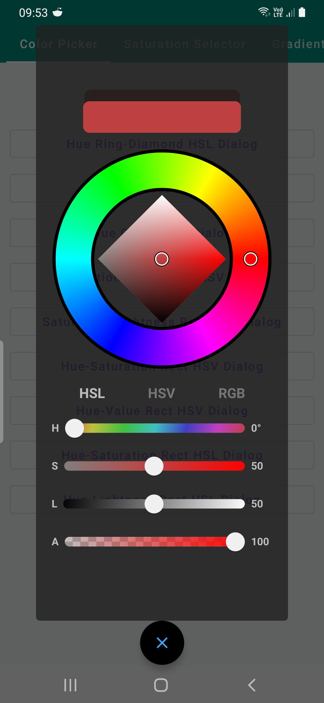
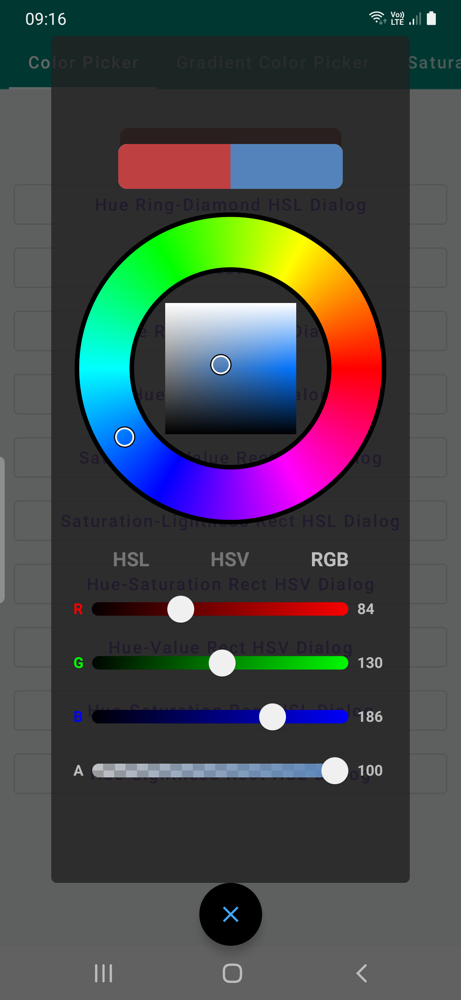
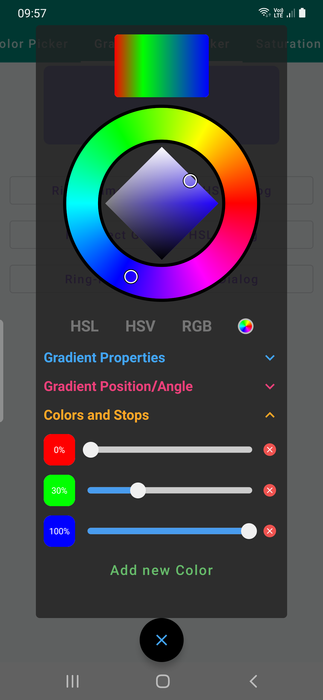
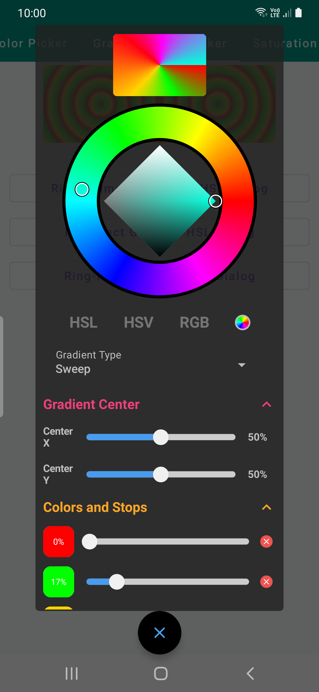
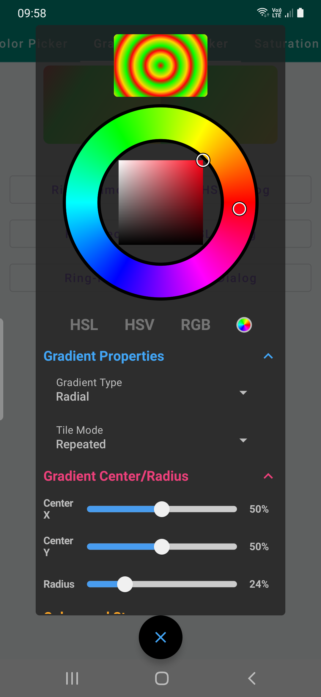
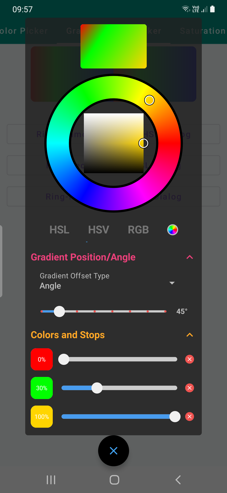
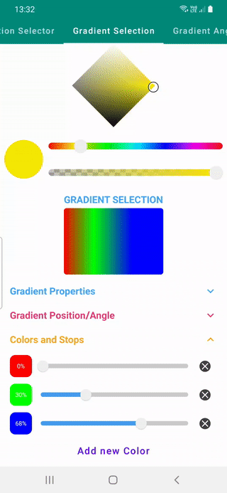

### Jetpack Compose Color Picker

Bundle of Stylish customizable Color pickers, selectors, colorful sliders written with Jetpack
Compose enables users to choose from HSL, HSV or RGB color models to pick Solid colors or gradients.
With colorful Sliders, panels, hex and color displays and various elements to create customized
pickers based on preference.

There are 10(for now) different color pickers and 3 different color+gradient pickers available to
choose from to use as Composables or inside dialogs that are available in demos.

Inspired
by [mchome's flutter_colorpicker  for Flutter](https://github.com/mchome/flutter_colorpicker)

### Color Pickers

There are various selection of default color pickers and with selectors sliders, and hex displays
it's possible to create new ones either.

| Hue Ring-Diamond HSL | Hue- Ring-Rect HSL | Hue Ring-Rect HSV| Hue-Circle HSV|
| ----------|-----------| -----------| -----------|
|  |  |  |   |

| Saturation-Value HSV | Saturation-Lightness HSL | Hue-Saturation HSV | Hue-Value HSV  |
| ----------|-----------| -----------| -----------|
|  |  |  |   |

| Hue-Saturation HSL     | Hue-Lightness HSL   | 
| ----------|-----------|
|  |  |

#### Implementation Hue Ring-Diamond HSL, Hue- Ring-Rect HSL,Hue Ring-Rect HSV

```
ColorPickerRingRectHSL(
  modifier: Modifier = Modifier,
  initialColor: Color,
  ringOuterRadiusFraction: Float = .9f,
  ringInnerRadiusFraction: Float = .6f,
  ringBackgroundColor: Color = Color.Transparent,
  ringBorderStrokeColor: Color = Color.Black,
  ringBorderStrokeWidth: Dp = 4.dp,
  selectionRadius: Dp = 8.dp,
  onColorChange: (Color) -> Unit
) 
```

ColorPicker with `SelectorRingHue` hue selector and `SelectorRectSaturationLightnessHSL`  saturation
lightness Selector that uses [HSL](https://en.wikipedia.org/wiki/HSL_and_HSV) color model as base.
This color picker has tabs section that can be changed between HSL, HSV and RGB color models and
color can be set using `CompositeSliderPanel` which contains sliders for each color models.

* **initialColor** color that is passed to this picker initially.
* **ringOuterRadiusFraction** outer radius of `SelectorRingHue`.
* **ringInnerRadiusFraction** inner radius of `SelectorRingHue`.
* **ringBackgroundColor** background from center to inner radius of `SelectorRingHue`.
* **ringBorderStrokeColor** stroke color for drawing borders around inner or outer radius.
* **ringBorderStrokeWidth** stroke width of borders.
* **selectionRadius radius** of white and black circle selector.
* **onColorChange** callback that is triggered when `Color` is changed
  using `SelectorRingHue` `SelectorDiamondSaturationLightnessHSL` or `CompositeSliderPanel`

#### Implementation for other Color Pickers

```
ColorPickerCircleValueHSV(
    modifier: Modifier = Modifier,
    selectionRadius: Dp = 8.dp,
    initialColor: Color,
    onColorChange: (Color) -> Unit
)
```

* **selectionRadius radius** of white and black circle selector.
* **initialColor** color that is passed to this picker initially.
* **onColorChange** callback that is triggered when `Color` is changed

### Gradient Color Pickers

| Hue Ring-Diamond HSL | Hue Ring-Diamond HSL2 | Hue- Ring-Rect HSL | Hue Ring-Rect HSV|
| ----------|-----------| -----------| -----------|
|  |  |  |   |

### Implementation

```
ColorPickerGradientRingDiamondHSL(
    modifier: Modifier = Modifier,
    initialBrushColor: BrushColor,
    gradientColorState: GradientColorState = rememberGradientColorState(),
    ringOuterRadiusFraction: Float = .9f,
    ringInnerRadiusFraction: Float = .6f,
    ringBackgroundColor: Color = Color.Black,
    ringBorderStrokeColor: Color = Color.Black,
    ringBorderStrokeWidth: Dp = 4.dp,
    selectionRadius: Dp = 8.dp,
    onBrushColorChange: (BrushColor) -> Unit
)
```

Gradients in Compose might require **Size**, Offset, or radius based on Linear, Radial, or Sweep
gradient is implemented.

A `GradientColorState` should be provided to this picker that hold **brush**, **color** and other
meta-data about the gradient or color. When there is no size provided you won't be able to choose
linear gradient with start end offset, angle rotation still available, or other gradients.

```
@Composable
fun rememberGradientColorState(
    color: Color = Color.Unspecified,
    size: DpSize = DpSize.Zero
): GradientColorState {

    val density = LocalDensity.current

    return remember {

        val sizePx = if (size == DpSize.Zero) {
            Size.Zero
        } else {
            with(density) {
                Size(
                    size.width.toPx(),
                    size.height.toPx()
                )
            }
        }
        GradientColorState(color, sizePx)
    }
}
```

Set size of your container that you wish to display gradients in and pass it

```
val size = DpSize(150.dp, 100.dp)

and initial color to be displayed on picker
val gradientColorState = rememberGradientColorState(
    color = currentBrushColor.color,
    size = size
)
```

`BrushColor` class is a color and brush wrapper class that is returned from gradient pickers in **
onChange** callback instead of **Color**

```
/**
 * Data class that contains [Brush] and [Color] and can return either based on user selection.
 */
data class BrushColor(
    var color: Color = Color.Unspecified,
    var brush: Brush? = null
) {
    /**
     * [Brush] that is not **null** [brush] property or [SolidColor] that is not nullable and
     * contains [color] property as [SolidColor.value]
     */
    val activeBrush: Brush
        get() = brush ?: solidColor

    /**
     * [SolidColor] is a [Brush] that
     * wraps [color] property that is used for [activeBrush] if [brush] property is **null**
     */
    val solidColor = SolidColor(color)
}
```

### Demos

* `SaturationSelectorDemo`  different type of Hue/Saturation/Value/Lightness Selectors
* `GradientSelection`  select gradient with varying properties such as tile mode, angle, size, or
  type, colors and color stops
* `GradientAngleDeme` gradient rotation with `GradientOffset` objects.
* `HSVHSLGradientDemo` various types of gradients for creating pickers
* `ColorfulSliderDemo` Sliders that can be used with different type of options with different
  Selectors and Pickers

| Selectors      | Gradient Selection   |Gradient Angle   | HSV/HSL Gradients| Colorful Sliders |
| ----------|-----------|-----------| -----------| -----------|
|  |  |  |   |  |

### Completed:

- [x] Add Hue Picker Wheel for selecting Hue
- [x] Add Saturation Rectangle for selecting Saturation and Lightness
- [x] Add Saturation Diamond for selecting Saturation and Lightness
- [x] Add Composable to display previous and current color
- [x] Fix Saturation Diamond color display for HSL
- [x] Add colorful Sliders to have more stylish sliders
- [x] Add gradient rotation option(GradientOffset)
- [x] Add HSV-HSL gradient demo
- [x] Add gradient rotation demo
- [x] Add checker Composable/Modifier that draws checker pattern behind to display alpha
- [x] Add console with interoperability between HSV, HSL and RGB(Conversion between color models)
- [x] Add Rectangle Hue+Saturation/Value/Lightness HSV/HSL Selectors
- [x] Add Circle Hue Saturation Selector
- [x] Add Composable to display colors in HEX and change color using TextField
- [x] Add option to display colors in a dialog
- [x] Add gradient color selection with percentage stops, linear, radial and sweep options
- [x] Add gradient selection demo

### TODOs:

- [ ] Add and display colors selected previously
- [ ] Add option to select colors from Image
- [ ] Add option to select colors from Screen
- [ ] Add option to select colors from Camera
  
