### Jetpack Compose Color Picker

Bundle of Stylish customizable Color pickers, selectors, colorful sliders written with Jetpack
Compose enables users to choose from HSL, HSV or RGB color models to pick Solid colors or gradients.

Inspired by mchome's (flutter_colorpicker)[https://github.com/mchome/flutter_colorpicker] for Flutter

### Color Pickers
There are various selection of default color pickers and with selectors sliders, and hex displays
it's possible to create new ones either.

| Hue Ring-Diamond HSL1 | Hue- Ring-Diamond HSL2 | Hue Ring-Rect HSV| Hue-Circle HSV|
| ----------|-----------| -----------| -----------|
|  | 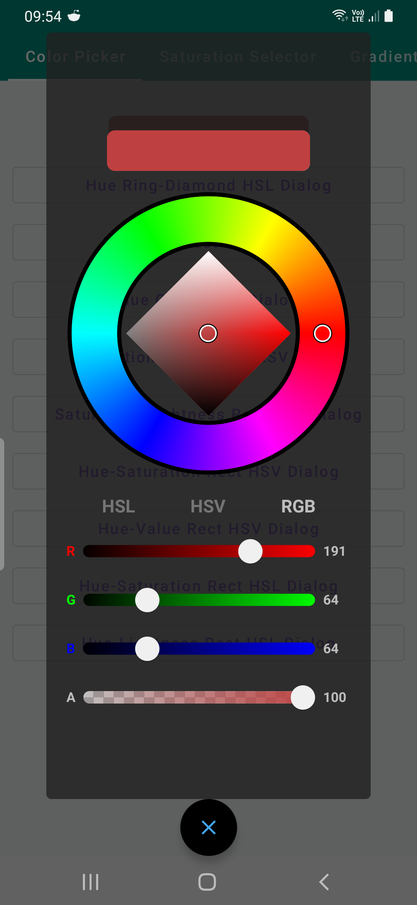 | 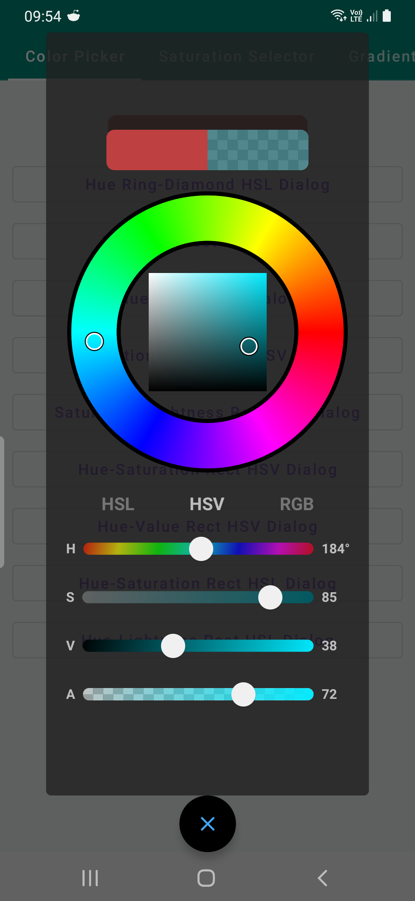 |  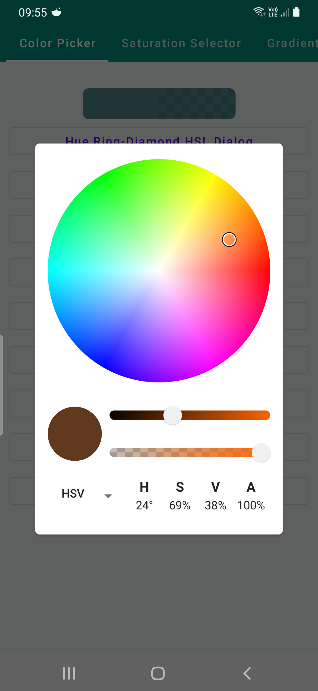 |

| Saturation-Value HSV | Saturation-Lightness HSL | Hue-Saturation HSV | Hue-Value HSV  |
| ----------|-----------| -----------| -----------|
| 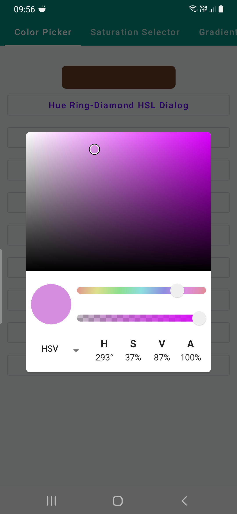 | 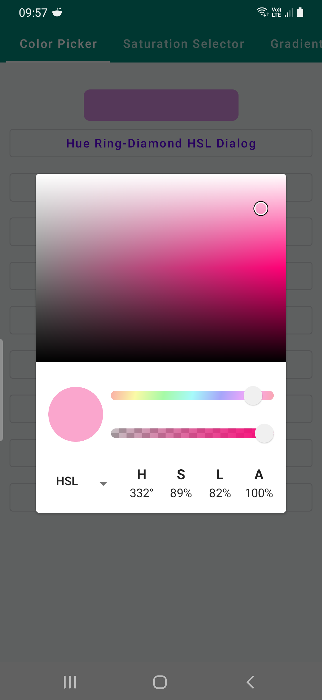 | 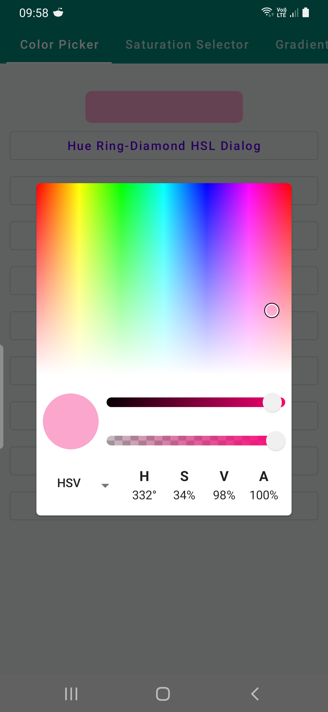 |  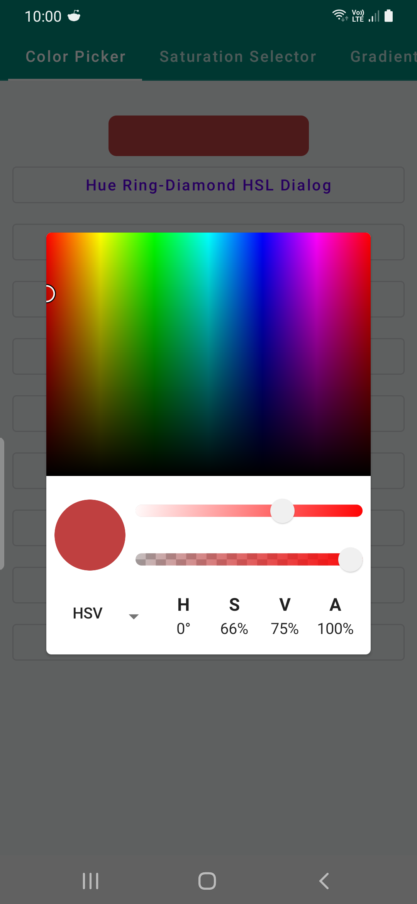 |

| Hue-Saturation HSL     | Hue-Lightness HSL   | 
| ----------|-----------|
| 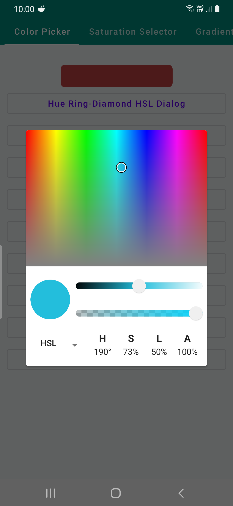 | 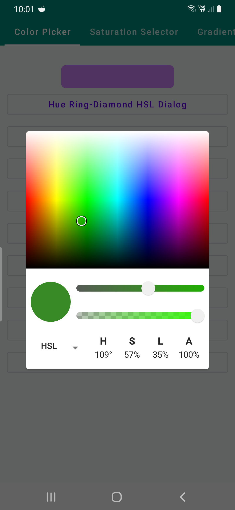 |

### Demos

* `SaturationSelectorDemo`  different type of Hue/Saturation/Value/Lightness Selectors
* `GradientAngleDeme` gradient rotation with `GradientOffset` objects.
* `HSVHSLGradientDemo` various types of gradients for creating pickers
* `ColorfulSliderDemo` Sliders that can be used with different type of options with different
  Selectors and Pickers

| Selectors      | Gradient Angle   | HSV/HSL Gradients| Colorful Sliders |
| ----------|-----------| -----------| -----------|
| 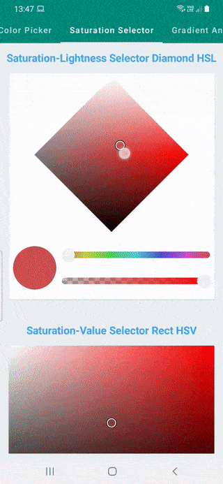 | 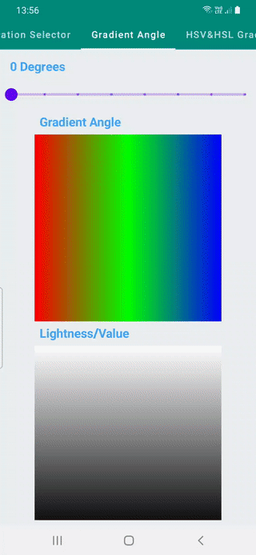 | 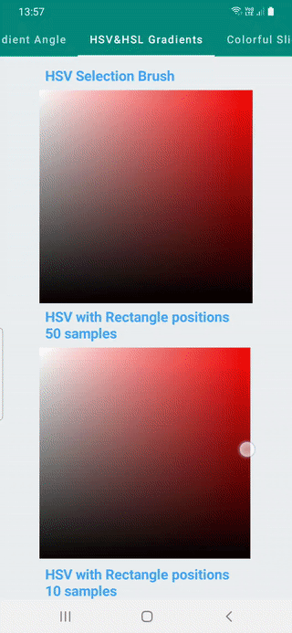 | 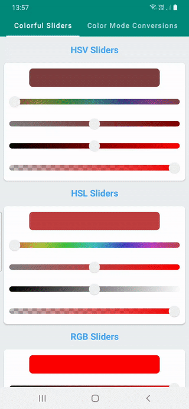 |

### Completed:

- [x] Add Hue Picker Wheel for selecting Hue
- [x] Add Saturation Rectangle for selecting Saturation and Lightness
- [x] Add Saturation Diamond for selecting Saturation and Lightness
- [x] Add Composable to display previous and current color
- [x] Fix Saturation Diamond color display for HSL
- [x] Add colorful Sliders to have more stylish sliders
- [x] Add gradient rotation option(GradientOffset)
- [x] Add HSV-HSL gradient demo
- [x] Add gradient rotation demo
- [x] Add checker Composable/Modifier that draws checker pattern behind to display alpha
- [x] Add console with interoperability between HSV, HSL and RGB(Conversion between color models)
- [x] Add Rectangle Hue+Saturation/Value/Lightness HSV/HSL Selectors
- [x] Add Circle Hue Saturation Selector
- [x] Add Composable to display colors in HEX and change color using TextField
- [x] Add option to display colors in a dialog

### TODOs:

- [ ] Add and display colors selected previously
- [ ] Add gradient color selection with percentage stops, linear, radial and sweep options
- [ ] Add option to select colors from Image
- [ ] Add option to select colors from Screen
- [ ] Add option to select colors from Camera
  
